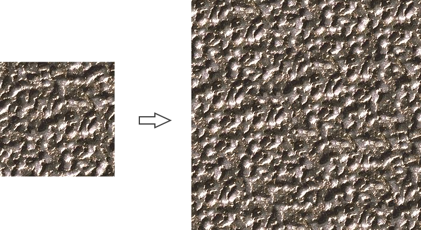
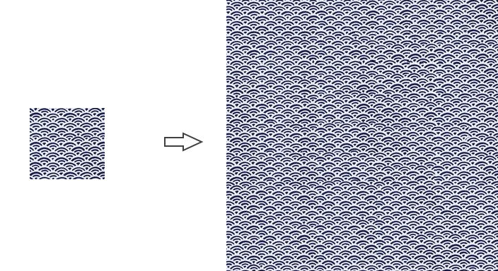

## ImageQuilting

C++ implementation of example-based texture synthesis algorithm in [Image Quilting for Texture Synthesis and Transfer](http://graphics.cs.cmu.edu/people/efros/research/quilting.html).

### Build

```shell
git clone --recursive https://github.com/AirGuanZ/ImageQuilting.git
cd ImageQuilting
mkdir build && cd build
cmake -DCMAKE_BUILD_TYPE=Release ..
```

### Run

```shell
./ImageQuilting(.exe) --help
```

### Examples

#### example.0



```shell
./ImageQuilting.exe --input=input.png --output=output.png --blockW=40 --blockH=40 --width=384 --height=384
```

#### example.1


```shell
./ImageQuilting.exe --input=input.png --output=output.png --blockW=100 --blockH=100 --width=384 --height=384
```

#### example.2


```shell
./ImageQuilting.exe --input=input.png --output=output.png --blockW=100 --blockH=100 --width=384 --height=384
```

#### example.4

