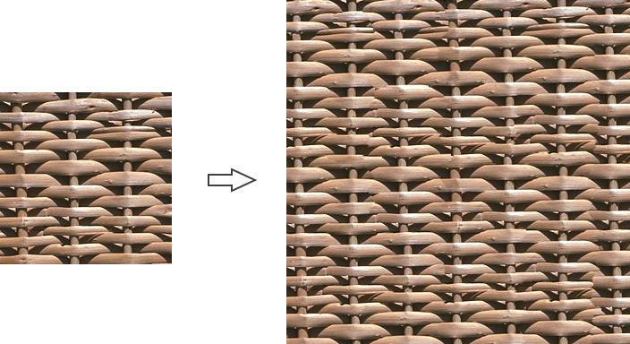

## ImageQuilting

C++ implementation of example-based texture synthesis algorithm in [Image Quilting for Texture Synthesis and Transfer](http://graphics.cs.cmu.edu/people/efros/research/quilting.html).

### Build

```shell
git clone --recursive https://github.com/AirGuanZ/ImageQuilting.git
cd ImageQuilting
mkdir build && cd build
cmake -DCMAKE_BUILD_TYPE=Release ..
```

### Run

```shell
./ImageQuilting(.exe) --help
```

### Examples

#### example.0


```shell
./ImageQuilting.exe --input=input.png --output=output.png --blockW=40 --blockH=40 --width=384 --height=384
```

#### example.1



```shell
./ImageQuilting.exe --input=input.png --output=output.png --blockW=100 --blockH=100 --width=384 --height=384
```

#### example.2


```shell
./ImageQuilting.exe --input=input.png --output=output.png --blockW=50 --blockH=50 --width=384 --height=384
```

#### example.3


```shell
./ImageQuilting.exe --input=input.png --output=output.png --width=384 --height=384 --blockW=40 --blockH=40
```

#### example.4


```shell
./ImageQuilting.exe --input=input.png --output=output.png --width=384 --height=384 --blockW=50 --blockH=50
```

#### example.5


```shell
./ImageQuilting.exe --input=input.png --output=output.png --width=384 --height=384 --blockW=90 --blockH=90 --mseBlock=true/false --minCutEdge=true/false --tolerance=0.05
```

